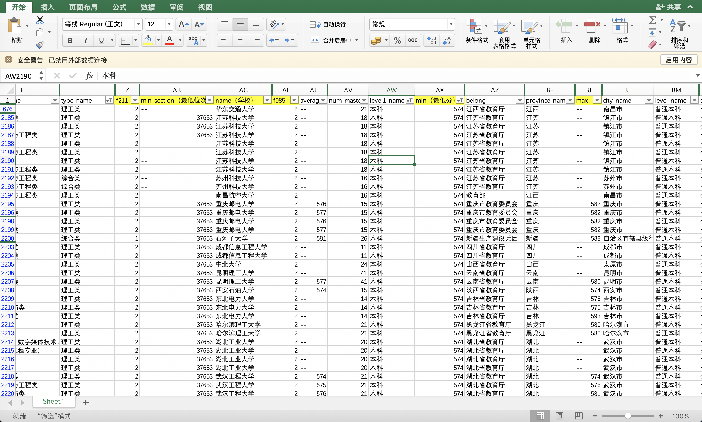

# 高考志愿筛选器

## AI or 人工

乘高考之风，已经有各种APP提供智能志愿筛选功能，嗯，人工智能。

但是，报志愿这个东西，是非常重要的，我更相信人工。

于是，就有了这个工具。数据从互联网抓取，并合并成csv格式，可以加载到Excel中非常方便的筛选。

## 如何使用

Step 1: 修改`config.py`，设置考生所在省份、文理科、抓取的时间范围。

Step 2：`sh run.sh`，等着就好，不求多快，但求不漏。

Step 3：打开Excel，加载生成的csv文件。

## 效果

## 免责声明

该工具仅供学习交流，您一旦使用，请自行承担相应的风险。

## License

MIT
